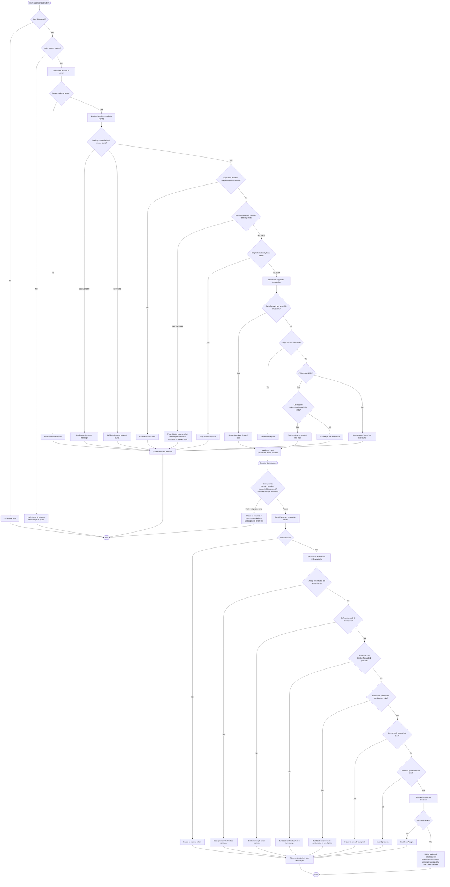

# WDC Stacker — Scan & Placement Flowchart

This flowchart documents the **actual** code-verified behavior of the Scan and Placement (Assign) process, based on a line-by-line review of:
- `WDC_STACKER.CLIENT/src/components/StackerOperationControls.tsx` (UI)
- `WDC_STACKER.API/Aggregate/StackerAggregate.cs` (`ScanHolderJobAsync`, `AssignHolderAsync`, `MapGridViewBoxData`)

---

## A. Text Description (Step-by-Step)

### Part 1 — Scan (Validation)
1. **Start**: Operator types/scans an item ID into the input field.
2. If the field is empty → nothing happens (silent, no request sent).
3. If no valid login session exists → show "Login token is missing. Please sign in again."; stop.
4. Send scan request to the server.
5. **Server check 1 — Session valid?** If not → return "Invalid or expired token." → Placement stays disabled.
6. **Server check 2 — Item record found?** Look up the item's job record.
   - If the lookup service itself fails → return that service's error message.
   - If no record is found → return "HolderJob record was not found."
7. **Server check 3 — Operation matches the configured valid operation?** If not → return "Operation is not valid."
8. **Server check 4 — ParentHolder condition.** *(See note below — current code rejects when ParentHolder HAS a value, but the message says "ParentHolder has no value!")* → return "ParentHolder has no value!"
9. **Server check 5 — ShipTicket must be blank.** If a ShipTicket value already exists → return "ShipTicket has value!"
10. **Server check 6 — Find a suggested storage box:**
    - If a box with used space between 0% and 100% exists → suggest the box with the smallest used-space percentage (ties broken by lowest rack/layer/column).
    - Else if no partially-used box exists, pick an empty (0%) box.
    - Else if **all** boxes are full (100%): try to automatically expand to a new column, then row, then rack (if the configured limits allow it) and suggest that new box.
    - Else, if expansion limits are also exhausted → return "All Settings are maxed out!"
    - Else (no boxes exist / cannot resolve) → return "No suggested target box was found."
11. If a box was successfully suggested → return "Validation Pass!" with the suggested box marked; **Placement button becomes enabled**.
12. If any check (5–10) failed → Placement button stays **disabled**; error message shown to the operator.

> **UI note:** Steps 5–9 return a response with no box list at all. The screen still updates its box list to *empty* in this case, which can momentarily clear the previously displayed rack grid.

### Part 2 — Placement (Assign)
13. Operator clicks the **Assign** button (only clickable if step 11 succeeded on the current, unedited scan value).
14. **Client-side guards** (kept as a safety net, but not reachable through normal use since the button is disabled otherwise):
    - Empty item ID → "Holder is required."
    - Missing session → "Login token is missing..."
    - No suggested box in memory → "No suggested target box was found."
15. Send placement request to the server (item ID + the suggested box's location + a fixed process type).
16. **Server check 1 — Session valid?** If not → "Invalid or expired token."
17. **Server check 2 — Item record found again?** (Re-checked independently of the scan step.) If lookup fails or no record → matching error message.
18. **Server check 3 — Box label (`BinName`) must be exactly 5 characters.** If not → "BinName length is not eligible." *(Not checked during scan — new check.)*
19. **Server check 4 — Build code and product name must both be present.** If either is missing → "BuildCode or ProductName is missing." *(New check.)*
20. **Server check 5 — Build code + box label combination must match a configured code.** If it doesn't match → "BuildCode and BinName combination is not eligible." *(New check.)*
21. **Server check 6 — Is the item already placed in a box?** (Re-checked against the database at this exact moment — protects against a second operator placing the same item in between.) If already placed → "Holder is already assigned."
22. **Server check 7 — Process type valid (PWD or FGI)?** If not → "Invalid process." *(In practice this value is fixed by client configuration, so this is rarely user-triggerable.)*
23. **Save to database.** If the save fails unexpectedly → "Unable to Assign."
24. **Success** → "Holder assigned successfully." (existing box) or "Box created and holder assigned successfully." (new box); rack view updates; **End**.

---

## B. Mermaid Diagram



---

## C. Notes / Discrepancies Found During Review

1. **Bug — ParentHolder message mismatch:** In `StackerAggregate.ScanHolderJobAsync`, the active code is:
   ```csharp
   // 2. ParentHolder must have value
   //if (string.IsNullOrWhiteSpace(parentHolder))
   if (!string.IsNullOrWhiteSpace(parentHolder))
   {
       Message = "ParentHolder has no value!"
   }
   ```
   The condition fires when `ParentHolder` **does** have a value, but the message says it has **no** value. Either the condition or the message text appears to be inverted from intent. **Needs confirmation from the dev team** on which is correct before finalizing test expectations.

2. **Scan does not fully validate what Assign will check.** A holder can pass scan ("Validation Pass!") and still fail at the Assign step due to `BinName` length, missing `BuildCode`/`ProductName`, or an invalid `BuildCode`+`BinName` combination — none of which are checked during scan.

3. **Client-side guards in `handleAssign` (empty holder / missing token / no suggested box) are not reachable through normal UI interaction**, because the Assign button is disabled until a scan succeeds, and editing the scan field immediately re-disables it. These guards only matter if the API is called directly or in a rare timing edge case (e.g., token expires between scan and click).

4. **A failed/blocked scan clears the rack grid view.** Any scan failure that returns before the box-mapping step (invalid session, record not found, invalid operation, ParentHolder/ShipTicket checks) does not include a box list in its response, so the UI updates the rack view to an **empty list** in those cases.

5. **Disassociate (removal) does more than a simple delete:** it also checks FEATS for an active "InSite hold" (`HoldReason`/`HoldComment` must both be blank) and performs a FEATS "Move Out" transaction *before* deleting the database assignment record. Both of these can independently cause the removal to fail.
